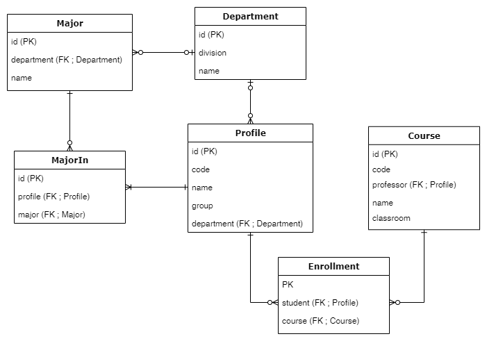
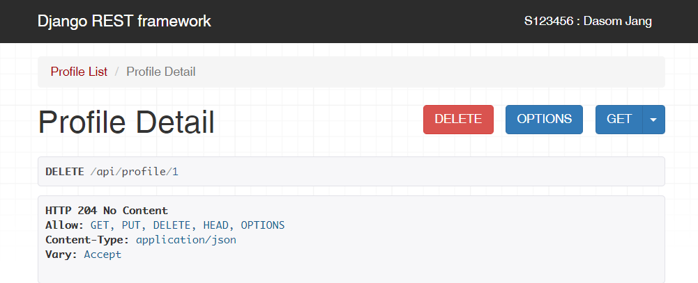

# django-rest-framework-12th

## 유의사항
* 본 레포지토리는 백엔드 스터디 2-3주차의 과제를 위한 레포입니다.
* 따라서 해당 레포를 fork 및 clone 후 local에서 본인의 깃헙 ID 브랜치로 작업한 후 커밋/푸시하고,
PR 보낼 때도 `본인의 브랜치-> 본인의 브랜치`로 해야 합니다.

## 2주차 과제 (기한: 9/26 토요일까지)

<details>
 <summary> 과제 내용 보기 </summary>
 <div markdown="1">

[과제 안내 노션](https://www.notion.so/2-Django-ORM-c46e2d2f88ac4d948d012c07605d8e03)

### 서비스 설명
본인이 선택한 서비스에 대한 설명을 적어주세요!

### 모델 설명
서비스에 대해 본인이 작성한 모델들에 대한 설명과 모델 간의 관계 등을 적어주세요!

### ORM 적용해보기
shell에서 작성한 코드와 그 결과를 보여주세요! 

### 간단한 회고 
과제 시 어려웠던 점이나 느낀 점, 좋았던 점 등을 간단히 적어주세요!
 </div>
</details>


## 3주차 과제 (기한: 10/3 토요일까지)
[과제 안내 노션](https://www.notion.so/3-DRF1-API-View-6d49c6ad888d4f249ffb52f0885c66d7)

### 모델 선택 및 데이터 삽입

```
mysql> select * from api_department;
+----+-----------------+----------------------+
| id | division        | name                 |
+----+-----------------+----------------------+
|  1 | Engineering     | Computer Engineering |
|  2 | Natural Science | Mathematics          |
+----+-----------------+----------------------+
2 rows in set (0.00 sec)

mysql> select * from api_course;
+----+----------+------------------------------------+-----------+--------------+
| id | code     | name                               | classroom | professor_id |
+----+----------+------------------------------------+-----------+--------------+
|  1 | 12345-01 | Data Structure                     | EB123     |            2 |
|  2 | 67890-02 | Differential and Integral Calculus | NA123     |            3 |
+----+----------+------------------------------------+-----------+--------------+
2 rows in set (0.00 sec)

mysql> select * from api_major;
+----+----------------------+---------------+
| id | name                 | department_id |
+----+----------------------+---------------+
|  1 | Computer Engineering |             1 |
|  2 | Mathematics          |             2 |
|  3 | Computer Vision      |             1 |
|  4 | Geometry             |             2 |
+----+----------------------+---------------+
4 rows in set (0.00 sec)

mysql> select * from api_profile;
+----+----------+--------------+-------+---------------+
| id | code     | name         | group | department_id |
+----+----------+--------------+-------+---------------+
|  1 | 1773139  | Dasom Jang   | U     |             1 |
|  2 | P1000001 | Com Kim      | P     |             1 |
|  3 | P2000001 | Math Lee     | P     |             2 |
|  4 | 1912345  | Gildong Hong | U     |             2 |
|  5 | G7654321 | Ceos Park    | G     |             1 |
+----+----------+--------------+-------+---------------+
5 rows in set (0.00 sec)

mysql> select * from api_enrollment;
+----+-----------+------------+
| id | course_id | student_id |
+----+-----------+------------+
|  1 |         1 |          1 |
|  2 |         2 |          4 |
+----+-----------+------------+
2 rows in set (0.00 sec)

mysql> select * from api_majorin;
+----+----------+------------+
| id | major_id | profile_id |
+----+----------+------------+
|  1 |        1 |          1 |
|  2 |        2 |          4 |
|  3 |        3 |          5 |
|  4 |        3 |          2 |
|  5 |        4 |          3 |
+----+----------+------------+
5 rows in set (0.00 sec)
```

### API
```python
from .serializers import *
from .models import *
from rest_framework.views import APIView
from rest_framework import status,response

'''profile'''
# api/profile/
class ProfileList(APIView): #APIView 상속

    # Profile 추가
    def post(self,request):
        serializer=ProfileSerializer(data=request.data) # serializer.data에 request.data 추가
        if serializer.is_valid():
            serializer.save() # 저장 : profile database에 반영됨
            return response.Response(serializer.data,status=status.HTTP_201_CREATED) # 모든 profile을 json 형태로 응답
        else:
            return response.Response(serializer.errors,status=status.HTTP_400_BAD_REQUEST)

    # 모든 Profile 조회
    def get(self, request): #모든 사용자 조회
        queryset=Profile.objects.all() # 모든 profile 쿼리셋 반환
        serializer=ProfileSerializer(queryset,many=True) # queryset serialize
        return response.Response(serializer.data) # serialization 결과인 serializer.data(json)으로 응답

# api/profile/pk
class ProfileDetail(APIView):

    # 특정 Profile 조회
    def get(self,request,pk):
        profile=Profile.objects.get(pk=pk) # Profile 인스턴스 반환
        serializer=ProfileSerializer(profile) # Profile 인스턴스 serialize
        return response.Response(serializer.data) # json 형태인 serializer.data로 응답

    # 특정 Profile 수정
    def put(self,request,pk):
        profile=Profile.objects.get(pk=pk)
        serializer=ProfileSerializer(profile,data=request.data) # profile 인스턴스를 serealize 후 request.data로 변경
        if serializer.is_valid():
            serializer.save() # 저장 : database에 반영됨
            return response.Response(serializer.data) # 변경된 데이터로 응답
        return response.Response(serializer.errors, status=status.HTTP_400_BAD_REQUEST)

    # 특정 Profile 제거
    def delete(self,request,pk):
        profile=Profile.objects.get(pk=pk) # 특정 profile 인스턴스를 받아서
        profile.delete() # 삭제
        return response.Response(status=status.HTTP_204_NO_CONTENT)
```
```python
from django.urls import path
from . import views
urlpatterns=[
    path('profile/',views.ProfileList.as_view()),
    path('profile/<int:pk>',views.ProfileDetail.as_view()),
    path('department/', views.DepartmentList.as_view()),
    path('department/<int:pk>', views.DepartmentDetail.as_view()),
    path('course/', views.CourseList.as_view()),
    path('course/<int:pk>', views.CourseDetail.as_view()),
    path('major/', views.MajorList.as_view()),
    path('major/<int:pk>', views.MajorDetail.as_view()),
    path('majorin/', views.MajorInList.as_view()),
    path('majorin/<int:pk>', views.MajorInDetail.as_view()),
    path('enrollment/', views.EnrollmentList.as_view()),
    path('enrollment/<int:pk>', views.EnrollmentDetail.as_view()),
]
```
### 모든 list를 가져오는 API
`GET : api/profile`
```json
[
    {
        "id": 1,
        "code": "1773139",
        "group": "U",
        "name": "Dasom Jang",
        "department_id": 1
    },
    {
        "id": 4,
        "code": "1912345",
        "group": "U",
        "name": "Gildong Hong",
        "department_id": 2
    },
    {
        "id": 5,
        "code": "G7654321",
        "group": "G",
        "name": "Ceos Park",
        "department_id": 1
    },
    {
        "id": 2,
        "code": "P1000001",
        "group": "P",
        "name": "Com Kim",
        "department_id": 1
    },
    {
        "id": 3,
        "code": "P2000001",
        "group": "P",
        "name": "Math Lee",
        "department_id": 2
    }
]
```

### 특정한 데이터를 가져오는 API
`GET : api/profile/1`
```json
{
    "id": 1,
    "code": "1773139",
    "group": "U",
    "name": "Dasom Jang",
    "department_id": 1
}
```

### 새로운 데이터를 create하도록 요청하는 API
`POST : api/profile`
```json
{
    "code": "1912345",
    "group": "U",
    "name": "Ceos Lee",
    "department_id": 1
}
```
```json
{
    "id": 7,
    "code": "1912345",
    "group": "U",
    "name": "Ceos Lee",
    "department_id": null
}
```
-> 왜 department_id 값이 적용되지 않을까요?


### (선택) 특정 데이터를 삭제 또는 업데이트하는 API
`PUT : api/profile/7`
```json
{
    "code": "1912345",
    "group": "U",
    "name": "Ceos Lee",
    "department_id": 1
}
```
```json
{
    "id": 7,
    "code": "1912345",
    "group": "U",
    "name": "Ceos Lee",
    "department_id": null
}
```  
`DELETE : api/profile/1`   



### 공부한 내용 정리
__1) 새로 알게된 점__  
__git__  

- add 취소 :
```
$git reset HEAD [file] 
$git reset HEAD *

```
- commit 취소
```
$git reset HEAD^ // 가장 최근의 commit 취소
$ git reset HEAD~2 // 마지막 2개의 commit을 취소
$ git reset --soft HEAD^ // 취소하고 해당 파일들은 staged 상태로 워킹 디렉터리에 보존
$ git reset --hard HEAD^ // commit을 취소하고 해당 파일들은 unstaged 상태로 워킹 디렉터리에서 삭제
```
- push 취소 
```
$ git reset HEAD^ //가장 최근 commit 취소
$ git log -g //commit log 확인
$ git reset [commit_id]
$ git commit -m "commit message"
```

__2) 정리 하고 싶은 개념__
- serialization : 모델 인스턴스와 같은 복잡한 데이터를 json, xml 등으로 쉽게 렌더링 할 수 있는 python datatype으로 변환
- serializer를 생성하기 위해 rest_framework.serializers.ModelSerializer를 상속한다.
- CBV를 만들 때에는 rest_framework.views.APIView를 상속한다.
- CBV에서 APIView의 post,get,put,delete 함수를 오버라이딩 한다.(???)
- APIView에서 응답을 할 때에는 rest_framework.response.Response 함수를 사용.

__3) 궁금한점__
- department_id의 값이 왜 변경이 안되는 지? (다른 값은 문제 없이 변경이 됨)

### 간단한 회고 
깃과의 전쟁을 치룬 일주일이었다. 푸시할 때 마다 작업한 게 날아가서 같은 코드를 4번씩 쓰는 신기한 경험을 했다. 그래도 깃에 대해 많이 배워서 행복하다. user model을 튜토리얼 따라서 새로 만들었는데 저게 맞는지 모르겠다(->규주님이 맞다고 하셨다). veiw에서 요청에 실패할 경우 응답을 보내는 방법(어떤 상태코드가 있는지)이 궁금하다.
