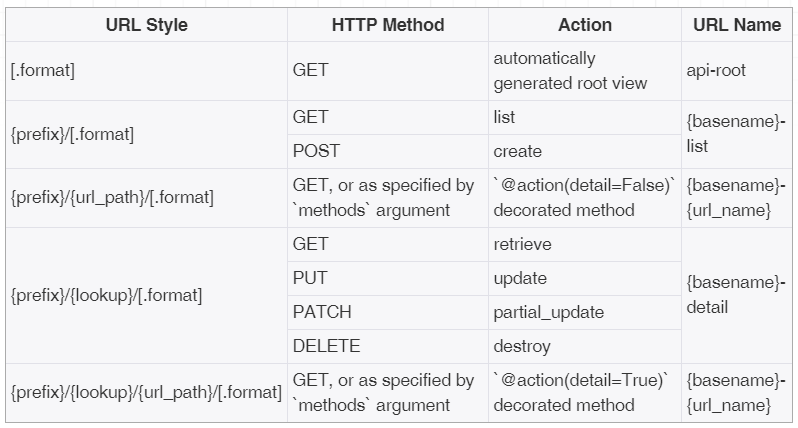
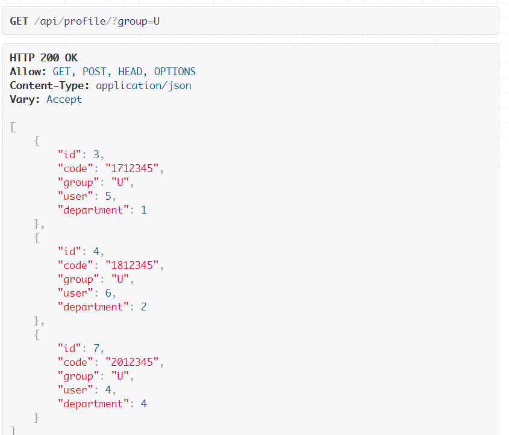
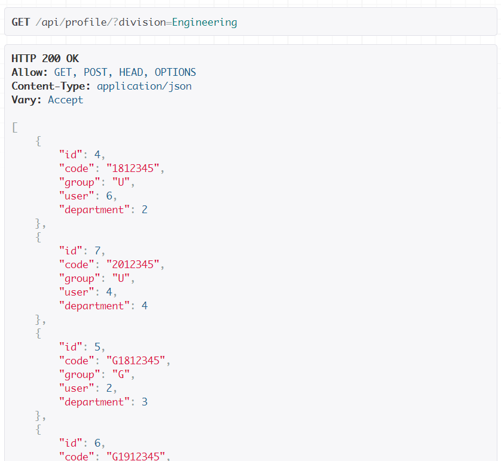
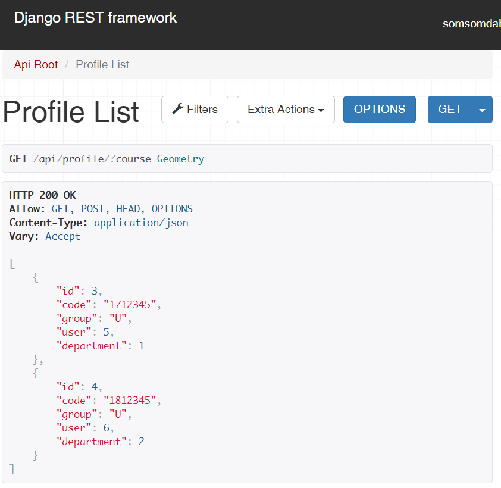

# django-rest-framework-12th

## 유의사항
* 본 레포지토리는 백엔드 스터디 2-3주차의 과제를 위한 레포입니다.
* 따라서 해당 레포를 fork 및 clone 후 local에서 본인의 깃헙 ID 브랜치로 작업한 후 커밋/푸시하고,
PR 보낼 때도 `본인의 브랜치-> 본인의 브랜치`로 해야 합니다.

## 2주차 과제 (기한: 9/26 토요일까지)

<details>
 <summary> 과제 내용 보기 </summary>
 <div markdown="1">

[과제 안내 노션](https://www.notion.so/2-Django-ORM-c46e2d2f88ac4d948d012c07605d8e03)

### 서비스 설명
본인이 선택한 서비스에 대한 설명을 적어주세요!

### 모델 설명
서비스에 대해 본인이 작성한 모델들에 대한 설명과 모델 간의 관계 등을 적어주세요!

### ORM 적용해보기
shell에서 작성한 코드와 그 결과를 보여주세요! 

### 간단한 회고 
과제 시 어려웠던 점이나 느낀 점, 좋았던 점 등을 간단히 적어주세요!
 </div>
</details>


## 3주차 과제 (기한: 10/3 토요일까지)
<details>
 <summary> 과제 내용 보기 </summary>
 <div markdown="1">
[과제 안내 노션](https://www.notion.so/3-DRF1-API-View-6d49c6ad888d4f249ffb52f0885c66d7)

### 모델 선택 및 데이터 삽입

```
mysql> select * from api_department;
+----+-----------------+----------------------+
| id | division        | name                 |
+----+-----------------+----------------------+
|  1 | Engineering     | Computer Engineering |
|  2 | Natural Science | Mathematics          |
+----+-----------------+----------------------+
2 rows in set (0.00 sec)

mysql> select * from api_course;
+----+----------+------------------------------------+-----------+--------------+
| id | code     | name                               | classroom | professor_id |
+----+----------+------------------------------------+-----------+--------------+
|  1 | 12345-01 | Data Structure                     | EB123     |            2 |
|  2 | 67890-02 | Differential and Integral Calculus | NA123     |            3 |
+----+----------+------------------------------------+-----------+--------------+
2 rows in set (0.00 sec)

mysql> select * from api_major;
+----+----------------------+---------------+
| id | name                 | department_id |
+----+----------------------+---------------+
|  1 | Computer Engineering |             1 |
|  2 | Mathematics          |             2 |
|  3 | Computer Vision      |             1 |
|  4 | Geometry             |             2 |
+----+----------------------+---------------+
4 rows in set (0.00 sec)

mysql> select * from api_profile;
+----+----------+--------------+-------+---------------+
| id | code     | name         | group | department_id |
+----+----------+--------------+-------+---------------+
|  1 | 1773139  | Dasom Jang   | U     |             1 |
|  2 | P1000001 | Com Kim      | P     |             1 |
|  3 | P2000001 | Math Lee     | P     |             2 |
|  4 | 1912345  | Gildong Hong | U     |             2 |
|  5 | G7654321 | Ceos Park    | G     |             1 |
+----+----------+--------------+-------+---------------+
5 rows in set (0.00 sec)

mysql> select * from api_enrollment;
+----+-----------+------------+
| id | course_id | student_id |
+----+-----------+------------+
|  1 |         1 |          1 |
|  2 |         2 |          4 |
+----+-----------+------------+
2 rows in set (0.00 sec)

mysql> select * from api_majorin;
+----+----------+------------+
| id | major_id | profile_id |
+----+----------+------------+
|  1 |        1 |          1 |
|  2 |        2 |          4 |
|  3 |        3 |          5 |
|  4 |        3 |          2 |
|  5 |        4 |          3 |
+----+----------+------------+
5 rows in set (0.00 sec)
```

### API
```python
from .serializers import *
from .models import *
from rest_framework.views import APIView
from rest_framework import status,response

'''profile'''
# api/profile/
class ProfileList(APIView): #APIView 상속

    # Profile 추가
    def post(self,request):
        serializer=ProfileSerializer(data=request.data) # serializer.data에 request.data 추가
        if serializer.is_valid():
            serializer.save() # 저장 : profile database에 반영됨
            return response.Response(serializer.data,status=status.HTTP_201_CREATED) # 모든 profile을 json 형태로 응답
        else:
            return response.Response(serializer.errors,status=status.HTTP_400_BAD_REQUEST)

    # 모든 Profile 조회
    def get(self, request): #모든 사용자 조회
        queryset=Profile.objects.all() # 모든 profile 쿼리셋 반환
        serializer=ProfileSerializer(queryset,many=True) # queryset serialize
        return response.Response(serializer.data) # serialization 결과인 serializer.data(json)으로 응답

# api/profile/pk
class ProfileDetail(APIView):

    # 특정 Profile 조회
    def get(self,request,pk):
        profile=Profile.objects.get(pk=pk) # Profile 인스턴스 반환
        serializer=ProfileSerializer(profile) # Profile 인스턴스 serialize
        return response.Response(serializer.data) # json 형태인 serializer.data로 응답

    # 특정 Profile 수정
    def put(self,request,pk):
        profile=Profile.objects.get(pk=pk)
        serializer=ProfileSerializer(profile,data=request.data) # profile 인스턴스를 serealize 후 request.data로 변경
        if serializer.is_valid():
            serializer.save() # 저장 : database에 반영됨
            return response.Response(serializer.data) # 변경된 데이터로 응답
        return response.Response(serializer.errors, status=status.HTTP_400_BAD_REQUEST)

    # 특정 Profile 제거
    def delete(self,request,pk):
        profile=Profile.objects.get(pk=pk) # 특정 profile 인스턴스를 받아서
        profile.delete() # 삭제
        return response.Response(status=status.HTTP_204_NO_CONTENT)
```
```python
from django.urls import path
from . import views
urlpatterns=[
    path('profile/',views.ProfileList.as_view()),
    path('profile/<int:pk>',views.ProfileDetail.as_view()),
    path('department/', views.DepartmentList.as_view()),
    path('department/<int:pk>', views.DepartmentDetail.as_view()),
    path('course/', views.CourseList.as_view()),
    path('course/<int:pk>', views.CourseDetail.as_view()),
    path('major/', views.MajorList.as_view()),
    path('major/<int:pk>', views.MajorDetail.as_view()),
    path('majorin/', views.MajorInList.as_view()),
    path('majorin/<int:pk>', views.MajorInDetail.as_view()),
    path('enrollment/', views.EnrollmentList.as_view()),
    path('enrollment/<int:pk>', views.EnrollmentDetail.as_view()),
]
```
### 모든 list를 가져오는 API
`GET : api/profile`
```json
[
    {
        "id": 1,
        "code": "1773139",
        "group": "U",
        "name": "Dasom Jang",
        "department_id": 1
    },
    {
        "id": 4,
        "code": "1912345",
        "group": "U",
        "name": "Gildong Hong",
        "department_id": 2
    },
    {
        "id": 5,
        "code": "G7654321",
        "group": "G",
        "name": "Ceos Park",
        "department_id": 1
    },
    {
        "id": 2,
        "code": "P1000001",
        "group": "P",
        "name": "Com Kim",
        "department_id": 1
    },
    {
        "id": 3,
        "code": "P2000001",
        "group": "P",
        "name": "Math Lee",
        "department_id": 2
    }
]
```

### 특정한 데이터를 가져오는 API
`GET : api/profile/1`
```json
{
    "id": 1,
    "code": "1773139",
    "group": "U",
    "name": "Dasom Jang",
    "department_id": 1
}
```

### 새로운 데이터를 create하도록 요청하는 API
`POST : api/profile`
```json
{
    "code": "1912345",
    "group": "U",
    "name": "Ceos Lee",
    "department_id": 1
}
```
```json
{
    "id": 7,
    "code": "1912345",
    "group": "U",
    "name": "Ceos Lee",
    "department_id": null
}
```
-> 왜 department_id 값이 적용되지 않을까요?


### (선택) 특정 데이터를 삭제 또는 업데이트하는 API
`PUT : api/profile/7`
```json
{
    "code": "1912345",
    "group": "U",
    "name": "Ceos Lee",
    "department_id": 1
}
```
```json
{
    "id": 7,
    "code": "1912345",
    "group": "U",
    "name": "Ceos Lee",
    "department_id": null
}
```  
`DELETE : api/profile/1`   


### 공부한 내용 정리


- add 취소 :
```
$git reset HEAD [file] 
$git reset HEAD *

```
- commit 취소
```
$git reset HEAD^ // 가장 최근의 commit 취소
$ git reset HEAD~2 // 마지막 2개의 commit을 취소
$ git reset --soft HEAD^ // 취소하고 해당 파일들은 staged 상태로 워킹 디렉터리에 보존
$ git reset --hard HEAD^ // commit을 취소하고 해당 파일들은 unstaged 상태로 워킹 디렉터리에서 삭제
```
- push 취소 
```
$ git reset HEAD^ //가장 최근 commit 취소
$ git log -g //commit log 확인
$ git reset [commit_id]
$ git commit -m "commit message"
```


- serialization : 모델 인스턴스와 같은 복잡한 데이터를 json, xml 등으로 쉽게 렌더링 할 수 있는 python datatype으로 변환
- serializer를 생성하기 위해 rest_framework.serializers.ModelSerializer를 상속한다.
- CBV를 만들 때에는 rest_framework.views.APIView를 상속한다.
- CBV에서 APIView의 post,get,put,delete 함수를 오버라이딩 한다.(???)
- APIView에서 응답을 할 때에는 rest_framework.response.Response 함수를 사용.


### 간단한 회고 
깃과의 전쟁을 치룬 일주일이었다. 푸시할 때 마다 작업한 게 날아가서 같은 코드를 4번씩 쓰는 신기한 경험을 했다. user model을 튜토리얼 따라서 새로 만들었는데 저게 맞는지 모르겠다(+규주님이 맞다고 하셨다). veiw에서 요청에 실패할 경우 응답을 보내는 방법(어떤 상태코드가 있는지)이 궁금하다.
 </div>
</details>

## 4주차 과제
<details>
 <summary> 과제 내용 보기 </summary>
 <div markdown="1">
 
## ViewSet

### ViewSet이란?
- APIView는 List와 Detail 이라는 두개의 클래스가 있음, ViewSet을  사용하면 단일 클래스에서 view를 정의할 수 있음
- View들의 집합, 요청과 응답에 사용되는 여러개의 view들이 모여있음

### 상속관계
- APIView -> ViewSet
- GenericAPIView -> GenericViewSet, ModelViewSet

### ModelViewSet
```python
# APIView
from rest_framework.views import APIView
from rest_framework import status,response

# api/profile/
class ProfileList(APIView): #APIView 상속

    # Profile 추가
    def post(self,request,format=None):
        serializer=ProfileSerializer(data=request.data) # serializer.data에 request.data 추가
        if serializer.is_valid():
            serializer.save() # 저장 : profile database에 반영됨
            return response.Response(serializer.data,status=status.HTTP_201_CREATED) # 모든 profile을 json 형태로 응답
        else:
            return response.Response(serializer.errors,status=status.HTTP_400_BAD_REQUEST)

    # 모든 Profile 조회
    def get(self, request,format=None): #모든 사용자 조회
        queryset=Profile.objects.all() # 모든 profile 쿼리셋 반환
        serializer=ProfileSerializer(queryset,many=True) # queryset serialize
        return response.Response(serializer.data) # serialization 결과인 serializer.data(json)으로 응답

# api/profile/pk
class ProfileDetail(APIView):

    # 특정 Profile 조회
    def get(self,request,pk,format=None):
        profile=Profile.objects.get(pk=pk) # Profile 인스턴스 반환
        serializer=ProfileSerializer(profile) # Profile 인스턴스 serialize
        return response.Response(serializer.data) # json 형태인 serializer.data로 응답

    # 특정 Profile 수정
    def put(self,request,pk,format=None):
        profile=Profile.objects.get(pk=pk)
        serializer=ProfileSerializer(profile,data=request.data) # profile 인스턴스를 serealize 후 request.data로 변경
        if serializer.is_valid():
            serializer.save() # 저장 : database에 반영됨
            return response.Response(serializer.data) # 변경된 데이터로 응답
        return response.Response(serializer.errors, status=status.HTTP_400_BAD_REQUEST)

    # 특정 Profile 제거
    def delete(self,request,pk,format=None):
        profile=Profile.objects.get(pk=pk) # 특정 profile 인스턴스를 받아서
        profile.delete() # 삭제
        return response.Response(status=status.HTTP_204_NO_CONTENT)
```
```python
# ViewSet
class ProfileViewSet(viewsets.ViewSet):
    def list(self, request):
        queryset = Profile.objects.all()
        serializer = ProfileSerializer(queryset, many=True)
        return Response(serializer.data)

    def retrieve(self, request, pk=None):
        queryset = Profile.objects.all()
        user = get_object_or_404(queryset, pk=pk)
        serializer = ProfileSerializer(user)
        return Response(serializer.data)
```
```python
# ModelViewSet
from rest_framework import viewsets

class ProfileViewSet(viewsets.ModelViewSet):
    serializer_class = ProfileSerializer
    queryset = Profile.objects.all()
```
- Viewset은 자신만의 viewset 정의, ModelViewSet은 사전에 정의된 뷰(Retrive, List,Create,Destroy,Update) 제공
- ViewSet을 사용함으로써 반복 논리를 하나의 클래스로 결합 할 수 있다. 위의 예에서 쿼리셋은 한번만 지정하면 여러 view에서 사용된다.

### routers (urls.py)
- Router 클래스로 URLconf를 직접 입력하지 않고 url을 다룰 수 있다.
- 즉, router에 viewset을 등록하는 것은 urlpatterns 설정하기와 비슷하다.
- DefaultRouter()  

    - router = DefaultRouter(trailing_slash=False) : 끝에 '/' 를 붙일지 말지의 여부
    - {prefix} - The URL prefix to use for this set of routes. ex) api/profile/1 에서 "profile"
    - {lookup} - The lookup field used to match against a single instance. ex) api/profile/1에서 "1"

### decorator action
__action(methods,detail,url_name,url_path)__  
- methods : request method 지정, default='get'
- detail : True - pk 값 지정 필요
     - detail=True
        - url : /prefix/{pk}/{function name}/
    - detail=False
        - url : /prefix/{function name}/

### PUT vs PATCH
- PUT의 경우 자원 전체를 갱신하는 의미지만, PATCH는 해당자원의 일부를 교체하는 의미로 사용.

### view 에 @action 추가하기
```python
class ProfileViewSet(viewsets.ModelViewSet):
    serializer_class = ProfileSerializer
    queryset = Profile.objects.all()

    # url : api/profile/list-professors/
    @action(methods=['get'],detail=False,url_path='list-professors')
    def list_professors(self, request):
        qs = self.queryset.filter(group="P")
        serializer = self.get_serializer(qs, many=True)
        return response.Response(data=serializer.data,status=status.HTTP_200_OK)

    # url : api/profile/{pk}/set-graduate/
    @action(methods=['patch'],detail=True,url_path='set-graduate')
    def set_graduate(self, request, pk):
        instance = self.get_object()
        if instance.group=="U":
            instance.group = "G"
            instance.code = request.data['code']
            instance.department_id=request.data['department_id']
            instance.save()
        serializer = self.get_serializer(instance)
        return response.Response(data=serializer.data,status=status.HTTP_200_OK)
```
 </div>
</details>

## 5주차 과제
<details>
 <summary> 과제 내용 보기 </summary>
 <div markdown="1">
 
 ## 1. Filtering
 
__1. 사용자 그룹으로 필터링__
 ```python
# filters.py
class ProfileFilter(FilterSet):
    group = filters.CharFilter(field_name='group')
    division = filters.CharFilter(field_name='division', method='filter_by_division')
    course=filters.CharFilter(field_name='course',method='filter_by_coursename')

    class Meta:
        model = Profile
        fields = ['group']


 ```

  
__2. 특정 단대로 필터링__
```python
    # 단대로 filtering
    def filter_by_division(self, queryset, name, value):

        pks = []
        filtered = Profile.objects.none()

        # Department테이블에서 특정 division에 해당하는 primary key들 가져오기
        for obj in Department.objects.all():
            if obj.division == value:
                pks.append(obj.id)  # 특정 division에 해당하는 id 들 모두 append

        pks=list(set(pks))

        for pk in pks:
            filtered = filtered | Profile.objects.filter(department_id=pk)

        return filtered
```

  
  
__3. 특정 강좌를 듣는 학생들 필터링__
```python
    # 특정 강좌에 등록한 학생들
    def filter_by_coursename(self, queryset, name, value):

        student_ids = []
        course_id = Course.objects.get(name=value).id

        for obj in Enrollment.objects.filter(course_id=course_id):
            student_ids.append(obj.student_id)

        filtered = Profile.objects.filter(id__in=student_ids)

        return filtered
```

 
 ## 2. Permissions
 
 ### Django Permissions
 - `AllowAny` 모든 요청에 대해 허가
 - `IsAuthenticated` 유저가 존재하고 로그인 되어 있을 경우에 허가
 - `IsAdminUser` 유저가 존재하고 스태프일 경우에 허가
 - `IsAuthenticatedOrReadOnly` 안전한 request method 이거나 유저가 존재하고 로그인 되어 있을 경우에 허가
 
```python
class IsSuperUserOrReadOnly(permissions.BasePermission):

    # 인증된 유저에 대해 접근 허용
    def has_permission(self, request, view):
        return request.user.is_authenticated

    def has_object_permission(slef, request, views, obj):
        # 조회 요청은 항상 True
        if request.method in permissions.SAFE_METHODS:
            return True
        # PUT, DELETE 요청에 한해 SuperUser에게만 허용
        return request.user.is_superuser


class IsUserOrSuperUser(permissions.BasePermission):

    def has_object_permission(self, request, view, obj):
        # 조회 요청은 해당 유저만 가능
        if request.method in permissions.SAFE_METHODS:
            return obj.profile==request.user

        # PUT, DELETE 요청에 한해 SuperUser에게만 허용
        return request.user.is_superuser

class IsStudentOrSuperUser(permissions.BasePermission):

    def has_object_permission(self, request, view, obj):
        # 조회 요청은 해당 유저만 가능
        if request.method in permissions.SAFE_METHODS:
            return obj.student==request.user

        # PUT, DELETE 요청에 한해 SuperUser에게만 허용
        return request.user.is_superuser

```
```python
class ProfileViewSet(viewsets.ModelViewSet):
    serializer_class = ProfileSerializer
    queryset = Profile.objects.all()

    # url : api/profile/list-professors/
    @action(methods=['get'],detail=False,url_path='list-professors')
    def list_professors(self, request):
        qs = self.queryset.filter(group="P")
        serializer = self.get_serializer(qs, many=True)
        return response.Response(data=serializer.data,status=status.HTTP_200_OK)

    # url : api/profile/{pk}/set-graduate/
    @action(methods=['patch'],detail=True,url_path='set-graduate')
    def set_graduate(self, request, pk):
        instance = self.get_object()
        if instance.group=="U":
            instance.group = "G"
            instance.code = request.data['code']
            instance.department_id=request.data['department_id']
            instance.save()
        serializer = self.get_serializer(instance)
        return response.Response(data=serializer.data,status=status.HTTP_200_OK)

    filter_backends = [DjangoFilterBackend]
    filterset_class = ProfileFilter
    permission_classes=[permissions.IsAdminUser] # staff일 경우에만 프로필 접근 허용


class DepartmentViewSet(viewsets.ModelViewSet):
    serializer_class = DepartmentSerializer
    queryset = Department.objects.all()
    permission_classes=[permissions.IsAuthenticated] # 로그인 시 접근 허용

class CourseViewSet(viewsets.ModelViewSet):
    serializer_class = CourseSerializer
    queryset = Course.objects.all()
    pemission_classes = [IsSuperUserOrReadOnly] # SuperUser만 강의 개설, 삭제 허용

class MajorViewSet(viewsets.ModelViewSet):
    serializer_class = MajorSerializer
    queryset = Major.objects.all()
    permission_classes=[permissions.IsAuthenticated] # 로그인 시 접근 허용

class MajorInViewSet(viewsets.ModelViewSet):
    serializer_class = MajorInSerializer
    queryset = MajorIn.objects.all()
    permission_classes=[IsUserOrSuperUser] #자신의 전공정보만 접근 허용, 전공변경은 SuperUser만

class EnrollmentViewSet(viewsets.ModelViewSet):
    serializer_class = EnrollmentSerializer
    queryset = Enrollment.objects.all()
    permission_classes=[IsUserOrSuperUser] #자신의 수강신청 정보만 접근 허용, 전공변경은 SuperUser만

```

 </div>
</details>