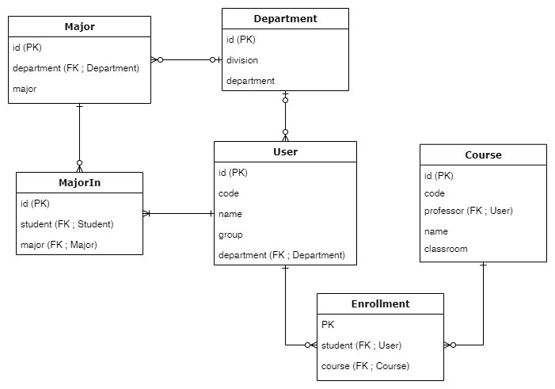

# django-rest-framework-12th

## 유의사항
* 본 레포지토리는 백엔드 스터디 2-3주차의 과제를 위한 레포입니다.
* 따라서 해당 레포를 fork 및 clone 후 local에서 본인의 깃헙 ID 브랜치로 작업한 후 커밋/푸시하고,
PR 보낼 때도 `본인의 브랜치-> 본인의 브랜치`로 해야 합니다.

## 2주차 과제 (기한: 9/26 토요일까지)

 
 과제 내용 보기 

 

[과제 안내 노션](https://www.notion.so/2-Django-ORM-c46e2d2f88ac4d948d012c07605d8e03)

### 서비스 설명
- 수강신청 서비스

### 모델 설명

### ORM 적용해보기
shell에서 작성한 코드와 그 결과를 보여주세요! 

### 간단한 회고 
모델을 밀고 모델링 다시함-> 다시 짠 모델 날아감->커밋을 했는데 로그에 커밋이 없음, 되돌릴 방법 없음!->모델을 다시 짬 (ㅂㄷㅂㄷ)
모델을 몇번을 짜는건지 모르겠다
 

## 3주차 과제 (기한: 10/3 토요일까지)
[과제 안내 노션](https://www.notion.so/3-DRF1-API-View-6d49c6ad888d4f249ffb52f0885c66d7)

### 모델 선택 및 데이터 삽입

선택한 모델의 구조와 데이터 삽입 후의 결과화면을 보여주세요!

### 모든 list를 가져오는 API
API 요청한 URL과 결과 데이터를 코드로 보여주세요!

### 특정한 데이터를 가져오는 API
API 요청한 URL과 결과 데이터를 코드로 보여주세요!

### 새로운 데이터를 create하도록 요청하는 API
요청한 URL 및 Body 데이터의 내용과 create된 결과를 보여주세요!

### (선택) 특정 데이터를 삭제 또는 업데이트하는 API
위의 필수 과제와 마찬가지로 요청 URL 및 결과 데이터를 보여주세요!

### 공부한 내용 정리
새로 알게된 점, 정리 하고 싶은 개념, 궁금한점 등을 정리해 주세요

### 간단한 회고 
과제 시 어려웠던 점이나 느낀 점, 좋았던 점 등을 간단히 적어주세요!
